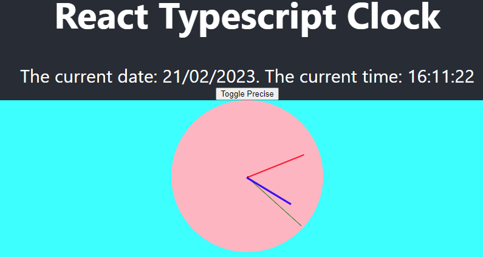
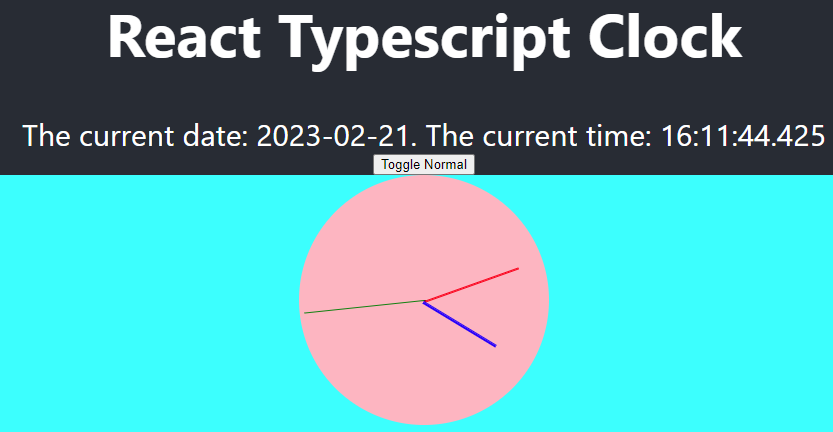

# React TypeScript Clock

This React TypeScript Clock is an exercise of React.js + TypeScript + simple dynamic CSS

## Digital Clock

A button is used to toggle between "Normal mode" and "Precise mode".  

## Analog Clock

A Clock is built with css updating every second. No extra library was used.  

## Screenshots

  
